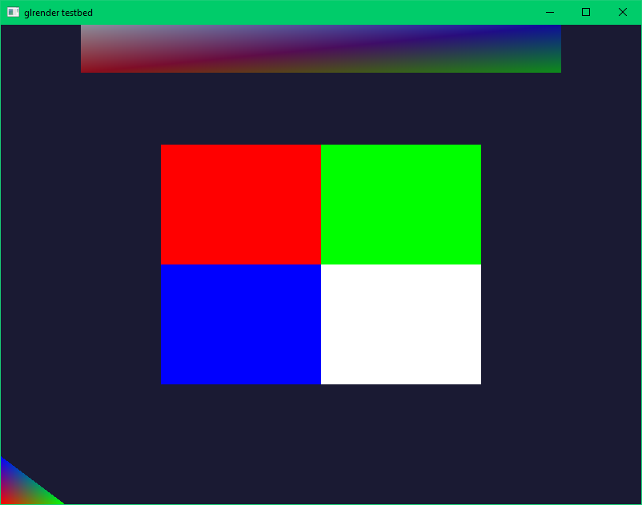

# GLRender

## Description

A tiny legacy OpenGL renderer heavily inspired by [PixelRift's easy renderer](https://github.com/PixelRifts/easy-renderer).

The API is in `glrender.h` and the implementation in `glrender.c`.

## Usage

This is a very basic example:

```c
#include "glrender.h"

glr_renderer renderer;

#define IMG_WIDTH 2
#define IMG_HEIGHT 2

/*
 * This is the image raw data I want to print on the screen.
 * The pixel is stored in memory as RGBA (big-endian).
 */
uint32_t img_raw_data[IMG_WIDTH*IMG_HEIGHT] = {
    /* R     G     B     A         R      G     B     A */
    { 0xff, 0x00, 0x00, 0xff }, { 0x00, 0xff, 0x00, 0xff }, 
    { 0x00, 0x00, 0xff, 0xff }, { 0xff, 0xff, 0xff, 0xff }
};

int
main()
{
    /* You have to implement this function by yourself.*/
    create_window(800, 600);

    glr_init(&renderer, GLR_ALPHA_BLEND | GLR_DEPTH_TEST);
    glr_texture *texture = glr_texture_create_from_raw_data(
        &renderer,
        (void *)img_raw_data,
        IMG_WIDTH,
        IMG_HEIGHT,
        GLR_PIXEL_FORMAT_RGBA);
    if(!texture)
    {
        return(0);
    }

    quit_app = 0;
    while(!quit_app)
    {
        /* handle window's messages */
        quit_app = handle_window_messages();

        glr_begin(&renderer);

        glr_clear(&renderer, 0.1f, 0.1f, 0.2f, 1.0f);

        /* draw the texture in the middle of the screen */
        glr_vertex quad1[4] = {
            { -0.5f, -0.5f, 0.8f, 1.0f, 1.0f, 1.0f, 1.0f, 0.0f, 0.0f, texture },
            {  0.5f, -0.5f, 0.8f, 1.0f, 1.0f, 1.0f, 1.0f, 1.0f, 0.0f, texture },
            {  0.5f,  0.5f, 0.8f, 1.0f, 1.0f, 1.0f, 1.0f, 1.0f, 1.0f, texture },
            { -0.5f,  0.5f, 0.8f, 1.0f, 1.0f, 1.0f, 1.0f, 0.0f, 1.0f, texture }
        };
        glr_quad_push(&renderer, quad1);

        /* draw a multi-color quad on top */
        glr_vertex quad2[4] = {
            { -0.75f,  0.8f, 0.8f, 1.0f, 0.0f, 0.0f, 0.5f, 0.0f, 0.0f, 0 },
            {  0.75f,  0.8f, 0.8f, 0.0f, 1.0f, 0.0f, 0.5f, 1.0f, 0.0f, 0 },
            {  0.75f,  1.0f, 0.8f, 0.0f, 0.0f, 1.0f, 0.5f, 1.0f, 1.0f, 0 },
            { -0.75f,  1.0f, 0.8f, 1.0f, 1.0f, 1.0f, 0.5f, 0.0f, 1.0f, 0 }
        };
        glr_quad_push(&renderer, quad2);

        /* draw a triangle at the bottom */
        glr_vertex triangle1[3] = {
            { -1.0f, -1.0f, 0.8f, 1.0f, 0.0f, 0.0f, 1.0f, 0.0f, 0.0f, 0 },
            { -0.8f, -1.0f, 0.8f, 0.0f, 1.0f, 0.0f, 1.0f, 1.0f, 0.0f, 0 },
            { -1.0f, -0.8f, 0.8f, 0.0f, 0.0f, 1.0f, 1.0f, 1.0f, 1.0f, 0 },
        };
        glr_triangle_push(&renderer, triangle1);

        glr_end(&renderer);
    }

    return(0);
}
```

This should be the result:



You can also take a look at the `tests` folder.
